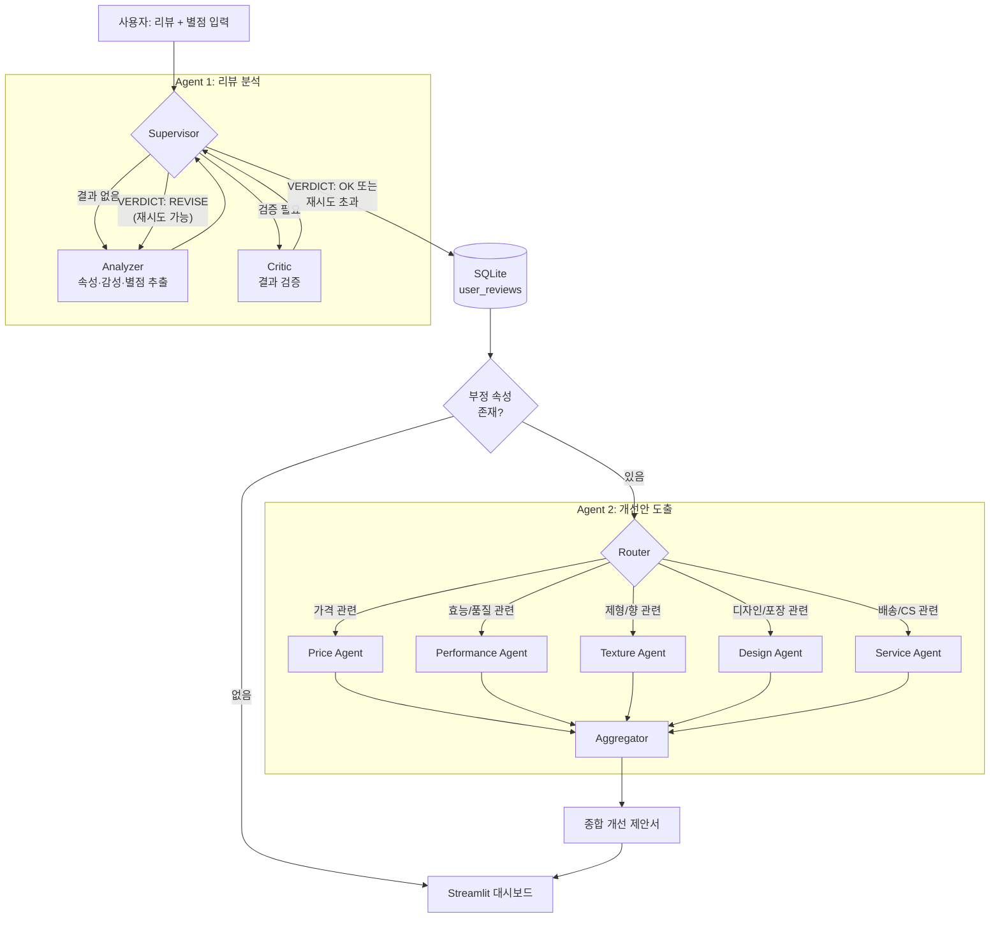

# 상품 리뷰 감성 분석 Multi-Agent 시스템

> KT AIVLE School AI 트랙 미니프로젝트 3차

비정형 상품 리뷰를 속성(aspect) 단위의 구조화된 감성 데이터로 변환하고, 부정적으로 평가된 속성에 대해서는 전문가 에이전트들이 개선안까지 제시하는 LangGraph 기반 멀티에이전트 시스템입니다.

## 프로젝트 소개

쇼핑몰에 쌓이는 리뷰는 "보습력은 좋은데 향이 별로예요" 처럼 여러 속성에 대한 평가가 한 문장에 섞여 있어, 사람이 일일이 읽지 않는 이상 어떤 부분이 잘 되고 있고 어떤 부분이 문제인지 파악하기 어렵습니다. 이 프로젝트는 이런 비정형 리뷰 텍스트를

- 어떤 속성(가격/보습/향/포장 등)이 언급됐는지
- 각 속성에 대한 감성이 긍정(1)인지 부정(0)인지
- 리뷰에 담긴 별점은 몇 점인지

의 구조화된 데이터로 변환하고, 나아가 부정적으로 언급된 속성에 대해서는 담당 분야 전문가가 원인과 개선 방안까지 제시하도록 설계했습니다.

단일 LLM 호출로 한 번에 처리하지 않고 **여러 개의 역할이 분리된 에이전트**로 나눈 이유는, (1) 분석 결과를 다른 에이전트가 검증하고 필요하면 재시도시켜 품질을 끌어올리고, (2) 후속 작업(개선안 도출)을 속성 성격에 맞는 전문 에이전트에게 위임해 각 제안의 전문성과 일관성을 높이기 위함입니다.

## 멀티에이전트 아키텍처

시스템은 두 개의 LangGraph로 구성됩니다.

### Agent 1 — 리뷰 분석 Agent (`src/agent1_review.py`)

| 에이전트 | 역할 |
|---|---|
| **Analyzer** | 리뷰 원문과 후보 속성 리스트를 받아 언급된 속성·감성(0/1)·별점을 JSON으로 추출. Critic의 피드백이 있으면 이를 반영해 재분석 |
| **Critic** | Analyzer 결과가 리뷰 원문과 논리적으로 일치하는지(속성 존재 여부, 감성 라벨의 타당성, 속성 순서, JSON 형식) 검증하고 `VERDICT: OK / REVISE` 판정 |
| **Supervisor** | 현재 상태를 보고 Analyzer → Critic → (재시도 또는 종료) 흐름을 제어. `VERDICT: REVISE`이고 최대 재시도(`max_num`) 이내면 Analyzer로 되돌림 |

Analyzer 단독 호출보다 Critic의 검증 루프를 거치도록 한 것이 이 시스템의 핵심 설계로, 설계 문서(`docs/agent_role_definition_*.xlsx`, `docs/workflow_spec_*.xlsx`)에도 각 에이전트의 입력/출력/제약조건/실패 리스크가 정의되어 있습니다. 초기 버전(`docs/*_v1.xlsx`, `notebooks/agent_v1.ipynb`)은 4개 속성(보습/가격/향/포장)·`적합/부적합` 판정 방식이었고, 최종 버전(`docs/*_final.xlsx`, `notebooks/agent_v2_final.ipynb`)에서는 후보 속성을 50개로 확장하고 판정 방식을 `[FEEDBACK]/VERDICT: OK|REVISE` 구조로, reason_code 기반 재시도 정책으로 고도화했습니다.

### Agent 2 — 개선안 도출 Agent (`src/agent2_insight.py`)

Agent 1이 찾아낸 부정 속성(label=0)을 받아, 어떤 부서가 대응해야 할지 라우팅한 뒤 해당 전문가가 원인 분석과 개선 방안을 제시합니다.

| 에이전트 | 담당 속성 |
|---|---|
| **Router** | 부정 속성 목록을 보고 아래 전문가 중 누구를 호출할지 결정 (여러 명 동시 호출 가능) |
| **Price** (가격 전략) | 가격, 할인, 가성비, 구성 |
| **Performance** (제품 개발) | 보습, 커버력, 발색, 자외선 차단, 효과, 성분 등 |
| **Texture** (제형 개발) | 발림성, 흡수력, 사용감, 제형, 자극, 향 |
| **Design** (제품 디자이너) | 디자인, 색상, 사이즈, 휴대성, 포장 |
| **Service** (CS 전략) | 배송, 만족도, 재구매, 사은품 |
| **Aggregator** | 호출된 전문가들의 제안을 하나의 종합 개선 리포트로 병합 |

Router가 `Send`로 여러 전문가에게 동시에(fan-out) 작업을 보내고, 모든 전문가의 결과를 Aggregator가 다시 모으는(fan-in) 구조입니다.

### 전체 흐름 (Mermaid)



## 데이터 설명

`data/reviews.csv` (200건, `review / aspect / label` 3개 컬럼)

- `review`: 화장품·생활용품 실제 구매 후기 원문 (한국어, 자유 서술형)
- `aspect`: 리뷰에 실제로 언급된 속성 리스트 (문자열로 저장된 파이썬 리스트). 데이터셋 전체에서 등장하는 속성은 `가격`, `보습`, `향`, `포장` 4종뿐입니다.
- `label`: `aspect`와 1:1 대응하는 감성 라벨 리스트 (1=긍정, 0=부정)

예시 (첫 행):
```
review: "연령상관없이 요즘 너무 인기 있어서 한번 사봤습니다. ... 다만 가격이 비싸서 아쉽고 구성도 더 알찼으면 좋았을 거 같아요."
aspect: ['가격']
label:  [0]
```

이 4개 속성은 데이터셋의 정답(ground truth) 라벨 기준이고, `src/config.py`의 `ASPECT_LIST`(50개)는 최종 버전에서 Analyzer가 더 다양한 리뷰를 처리할 수 있도록 팀이 직접 확장한 후보 속성 목록입니다 (이 확장된 속성들에 대한 정답 라벨은 원본 데이터셋에는 없습니다).

## 사용 기술 / 라이브러리

- **LLM**: OpenAI `gpt-4.1-mini` (에이전트별로 별도 인스턴스, temperature만 다르게 설정)
- **에이전트 오케스트레이션**: LangGraph (`StateGraph`, 조건부 엣지, `Send`를 이용한 fan-out/fan-in), LangChain (`ChatOpenAI`, 메시지 타입)
- **관측/평가**: LangSmith 트레이싱 (`LANGSMITH_TRACING`, 실행 trace 확인)
- **저장소**: SQLite (`sqlite3`)
- **대시보드**: Streamlit, Matplotlib, Seaborn (한글 폰트: NanumGothic)
- **배치 처리**: `asyncio` 기반 동시 실행 — 동기 처리 대비 약 **5.52배** 성능 향상 확인 (200건 기준)
- **원본 개발 환경**: Google Colab, Google Drive, Cloudflare Tunnel (Streamlit 외부 공개용) — 로컬/서버 실행을 위해 `src/` 코드에서는 제거하고 환경변수 기반으로 대체

## 결과

단일 리뷰에 대한 Agent 1 실행 결과 예시 (노트북 실행 로그, `notebooks/agent_v2_final.ipynb`에서 발췌):

입력: `"보습력이 정말 좋아요. 향도 괜찮지만 가격은 조금 비싸요."` (별점 4)

```
===== 최종 분석 결과 =====
{'review': '보습력이 정말 좋아요. 향도 괜찮지만 가격은 조금 비싸요.',
 'aspect': ['가격', '향', '보습'],
 'label': [0, 1, 1],
 'score': 4}

===== Critic 평가 =====
[FEEDBACK]
- '가격', '향', '보습' 세 가지 속성 모두 리뷰 원문에 명확히 언급되어 있어 aspect 선정은 적절함.
- 각 속성에 대한 label도 리뷰 내용과 일치함: 가격은 "조금 비싸요"로 불만족(0), 향은 "괜찮지만"으로 만족(1), 보습은 "정말 좋아요"로 만족(1).
- JSON 형식이 잘 유지되어 있음.
[VERDICT]
VERDICT: OK
```

200건 배치 분석 결과 DB 저장 예시:

```
(1, '연령상관없이 요즘 너무 인기 있어서 한번 사봤습니다. ... 가격이 비싸서 아쉽고 구성도 더 알찼으면...',
    '["보습", "가격", "향", "포장"]', '[1, 0, 0, 0]', 3, '2026-05-13 02:23:59')
```

대시보드에서는 이 저장된 결과를 속성별 긍/부정 건수, 별점 분포, 속성별 긍정비율로 시각화하고, 리뷰 건별 상세 조회를 제공합니다. 부정 속성이 있는 리뷰는 Agent 2가 자동으로 개선 제안(원인 분석 + 개선 방안)까지 생성합니다.

## 프로젝트 구조

```
03-Miniproject/
├── README.md
├── requirements.txt
├── notebooks/                      # 원본 Colab 노트북 (백업/기록용, 셀 순서 의존적)
│   ├── agent_v1.ipynb              # 초기 구현: Analyzer/Critic/Supervisor 기본 루프 + LangSmith + 배치 + 대시보드
│   └── agent_v2_final.ipynb        # 최종 제출본: 50개 속성 확장, reason_code 재시도 정책,
│                                    # 비동기 배치, Router+전문가 Agent 2 추가
├── src/                            # 노트북 로직을 정리한 순수 Python 모듈 (셀 순서와 무관하게 실행 가능)
│   ├── config.py                   # 공통 설정 (API 키, 모델, 속성 리스트)
│   ├── agent1_review.py            # Agent 1: Analyzer / Critic / Supervisor 그래프
│   ├── agent2_insight.py           # Agent 2: Router / 5개 전문가 / Aggregator 그래프
│   ├── db.py                       # SQLite 저장/조회 헬퍼
│   ├── main.py                     # CLI 진입점 (단건 분석 / CSV 배치 분석)
│   └── dashboard.py                # Streamlit 대시보드 (`streamlit run src/dashboard.py`)
├── data/
│   └── reviews.csv                 # 라벨링된 리뷰 200건 (review / aspect / label)
└── docs/                           # 설계 문서
    ├── agent_role_definition_v1.xlsx / _final.xlsx   # 에이전트 역할 정의서
    ├── workflow_spec_v1.xlsx / _final.xlsx           # Workflow·State·Decision Policy·Prompt 명세서
    └── presentation.pptx                             # 팀 발표 자료
```

### 실행 방법

```bash
pip install -r requirements.txt
export OPENAI_API_KEY="sk-..."

# 리뷰 1건 분석
python -m src.main demo --review "보습력이 정말 좋아요. 향도 괜찮지만 가격은 조금 비싸요." --score 4 --with-insights

# data/reviews.csv 전체를 SQLite로 배치 분석
python -m src.main batch --csv data/reviews.csv --concurrency 6

# 대시보드 실행
streamlit run src/dashboard.py
```
